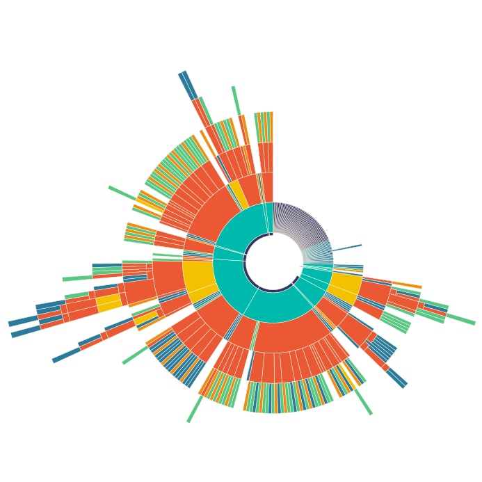

# Codinsky

Code inforgraphics. Cognition-driven.

[Playground](https://codinsky.js.org/)

<div align="center">
  
</div>

[`redux > createStore.js`](https://github.com/reduxjs/redux/blob/a58aa4eba546429c3e48dedc2368e4c1083b5ca4/src/createStore.js)

# Motivation

> Can't see the forest for the trees.

Immersed in a sea of statements and expressions, it is natural for developers to overlook the higher-level qualities of their code.

Codinsky provides a concise graphical overview of your script.

It can reveal a host of possible issues, and usher you to the land of cleaner, better structured, and more intelligible code.

# Example

Below is [`react-dom > client > ReactDOMComponent.js`](https://github.com/facebook/react/blob/c954efa70f44a44be9c33c60c57f87bea6f40a10/packages/react-dom/src/client/ReactDOMComponent.js).

With all due respect to Dan Abramov, this is A-HASHTAG-MESS.

<div align="center">
  
</div>

Insights:

## Excess

Generally speaking, if the sunburst visual is intimidating, so is the script.

There is just too much happening here, length and breadth.

Breaking such script down will:

- Allow readers to better assimilate the code.
- Make navigation easier (our spatial memory is potent, but it goes to waste with scripts as such).

## Nested Branching

<div align="center">
  
</div>

Testing nightmare.

Nested branches are also hard to comprehend because they consume both working-memory slots and logical reasoning cycles.

If you look at the code, much is wrapped with:

```javascript
if (__DEV__) {
  // Anything from 1 to 100 line block here.
}
```

A few concepts pop to mind:

- **Seperation of concerns**: dev/production.
- **Validation**: A cross-cutting concern, often solved with this pattern: `Client > Validation > Implementation`. In OOP [decorators](https://en.wikipedia.org/wiki/Decorator_pattern) do this; it's much easier with functional style.
- **Masking**: All these dev blocks are in the way for someone wishing to understand the production code (and likely vice-versa).

So perhaps anything dev should live in its own script. Doing so would leave us with:

<div align="center">
  
</div>

Better. With the exception of the flare around 8:00, this is very much a few functions with case statements (or else-if trains in this script).

## High Coupling

<div align="center">
  
</div>

You many need to zoom to see it, but between 0:00-2:00 it's nearly all import.

This script has loads of imports from quite a few sources, suggesting:

- Perhaps it is doing too much.
- It could be hard to test because you may have too much to mock.

Again, possibly breaking this script down is the way forward.
